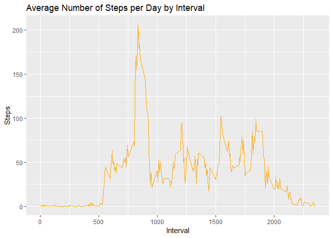

Introduction
------------

It is now possible to collect a large amount of data about personal movement using activity monitoring devices such as a Fitbit, Nike Fuelband, or Jawbone Up. These type of devices are part of the "quantified self" movement - a group of enthusiasts who take measurements about themselves regularly to improve their health, to find patterns in their behavior, or because they are tech geeks. But these data remain under-utilized both because the raw data are hard to obtain and there is a lack of statistical methods and software for processing and interpreting the data.

This assignment makes use of data from a personal activity monitoring device. This device collects data at 5 minute intervals through out the day. The data consists of two months of data from an anonymous individual collected during the months of October and November, 2012 and include the number of steps taken in 5 minute intervals each day.

Dataset is available on: <https://d396qusza40orc.cloudfront.net/repdata%2Fdata%2Factivity.zip>

Variables included are

-   steps: Number of steps taking in a 5-minute interval (missing values are coded as NA)
-   date: The date on which the measurement was taken in YYYY-MM-DD format
-   interval: Identifier for the 5-minute interval in which measurement was taken The dataset is stored in a comma-separated-value (CSV) file and there are a total of 17,568 observations in this dataset.

Assignment
----------

### Loading and preprocessing the data

Here we load all the packs needed and take a look of what data to we have. Rstudio will transform our date varialbe as a date and the others as left as numeric.

``` r
library(readr)
library(ggplot2)
library(lattice)
activity <- read_csv("~/R/Course 5 week 2 project/Reproducible Research - Project 1/Data/activity.csv")
```

    ## Parsed with column specification:
    ## cols(
    ##   steps = col_double(),
    ##   date = col_date(format = ""),
    ##   interval = col_double()
    ## )

``` r
str(activity)
```

    ## Classes 'tbl_df', 'tbl' and 'data.frame':    17568 obs. of  3 variables:
    ##  $ steps   : num  NA NA NA NA NA NA NA NA NA NA ...
    ##  $ date    : Date, format: "2012-10-01" "2012-10-01" ...
    ##  $ interval: num  0 5 10 15 20 25 30 35 40 45 ...
    ##  - attr(*, "spec")=
    ##   .. cols(
    ##   ..   steps = col_double(),
    ##   ..   date = col_date(format = ""),
    ##   ..   interval = col_double()
    ##   .. )

``` r
summary(activity)
```

    ##      steps             date               interval     
    ##  Min.   :  0.00   Min.   :2012-10-01   Min.   :   0.0  
    ##  1st Qu.:  0.00   1st Qu.:2012-10-16   1st Qu.: 588.8  
    ##  Median :  0.00   Median :2012-10-31   Median :1177.5  
    ##  Mean   : 37.38   Mean   :2012-10-31   Mean   :1177.5  
    ##  3rd Qu.: 12.00   3rd Qu.:2012-11-15   3rd Qu.:1766.2  
    ##  Max.   :806.00   Max.   :2012-11-30   Max.   :2355.0  
    ##  NA's   :2304

``` r
head(activity)
```

    ## # A tibble: 6 x 3
    ##   steps date       interval
    ##   <dbl> <date>        <dbl>
    ## 1    NA 2012-10-01        0
    ## 2    NA 2012-10-01        5
    ## 3    NA 2012-10-01       10
    ## 4    NA 2012-10-01       15
    ## 5    NA 2012-10-01       20
    ## 6    NA 2012-10-01       25

### What is the mean total number of steps taken per day?

First we take out all the missing values for a better analysis and use the aggregate function to have the sum of the total steps taken per day

``` r
activitynoNA <- na.omit(activity)
totalsteps <- aggregate(steps ~ date, activitynoNA, sum)
```

Then we make an histogram with the frequency of the amount of steps per day. Here we used the ggplot2 package

``` r
ggplot(totalsteps, aes (steps)) +
  geom_histogram(fill="Navy", bins = 45) +
  labs(title = "Daily Steps Histogram", x="Steps", y="Frequency") 
```


### Finally we calculate the mean and the median

``` r
mean(totalsteps$steps)
```

    ## [1] 10766.19

``` r
median(totalsteps$steps)
```

    ## [1] 10765

What is the average daily activity pattern.
-------------------------------------------

First we use the function aggregate to provide the mean of steps per interval

``` r
intsteps <- aggregate(steps ~ interval, activitynoNA, mean)
```

Then we perform a time series plot using the ggplot2 package.

``` r
ggplot(intsteps, aes (interval,steps)) +
  geom_line(color="Orange") +
  labs(title = "Average Number of Steps per Day by Interval", x="Interval", y="Steps") 
```



Finally we want to know what is the maximum number of steps in any interval

``` r
intsteps$interval[which.max(intsteps$steps)]
```

    ## [1] 835

Inputting the missing values
----------------------------

First we want to know how many missing values do we have

``` r
sum(is.na(activity))
```

    ## [1] 2304

Now we we are going to replace the missing values with the mean of the steps on each interval. First we create an index to see in what rows is there an NA, then with the previous dataframe we fill the missing values.

``` r
NAindex <- which(is.na(as.character(activity$steps)))
completeactivity <- activity
completeactivity[NAindex, ]$steps<-unlist(lapply(NAindex, FUN=function(NAindex){
  intsteps[activity[NAindex,]$interval==intsteps$interval,]$steps
}))
```

Then we generate an histogram based on the total steps and their frequency by date.

``` r
totalstepscomplete <- aggregate(steps ~ date, completeactivity, sum)
ggplot(totalstepscomplete, aes (steps)) +
  geom_histogram(fill="Red", bins = 45) +
  labs(title = "Daily Steps Histogram with Filled Values", x="Steps",y="Frequency") 
```


Now we calculate the mean and the median of steps on this data set.

``` r
mean(totalstepscomplete$steps)
```

    ## [1] 10766.19

``` r
median(totalstepscomplete$steps)
```

    ## [1] 10766.19

So what difference did we made?

``` r
mean(totalstepscomplete$steps) - mean(totalsteps$steps)
```

    ## [1] 0

``` r
median(totalstepscomplete$steps) - median(totalsteps$steps) 
```

    ## [1] 1.188679

So seems that the median is slightly higher in the new group and the mean is the same.

Are there any differences in activity patterns between weekdays and weekends?
-----------------------------------------------------------------------------

First we create a new column "day of the week" using the **Weekday()** function.

``` r
weekdays <- c("Monday", "Tuesday", "Wednesday", "Thursday", "Friday")
completeactivity$dayofweek = as.factor(ifelse(is.element(weekdays(completeactivity$date),weekdays), "Weekday", "Weekend"))
stepstotalwkd <- aggregate(steps ~ interval + dayofweek, completeactivity, mean)
```

Finally we create a plot using the lattice system to show the difference between weekend and weekdays.Seens that ib weekdays the peak step is higher!!

``` r
xyplot(stepstotalwkd$steps ~ stepstotalwkd$interval|stepstotalwkd$dayofweek, main="Average Steps per Day by Interval",xlab="Interval", ylab="Steps",layout=c(1,2), type="l")
```


